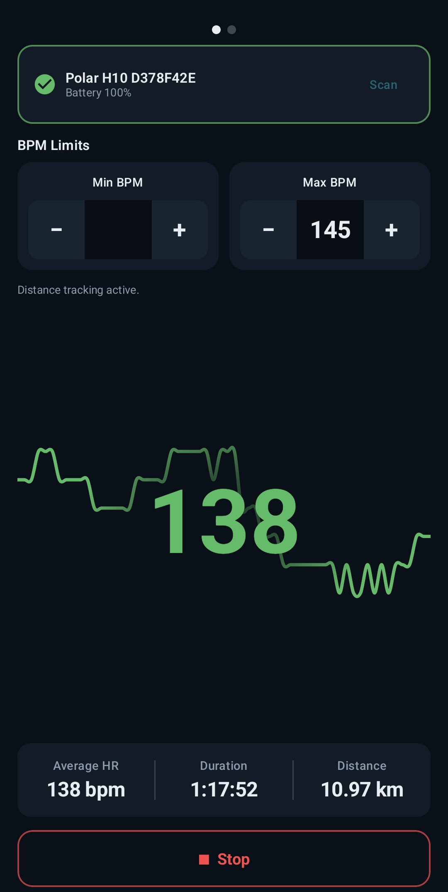
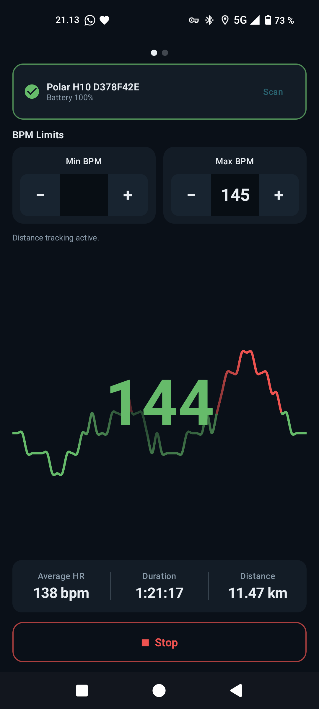
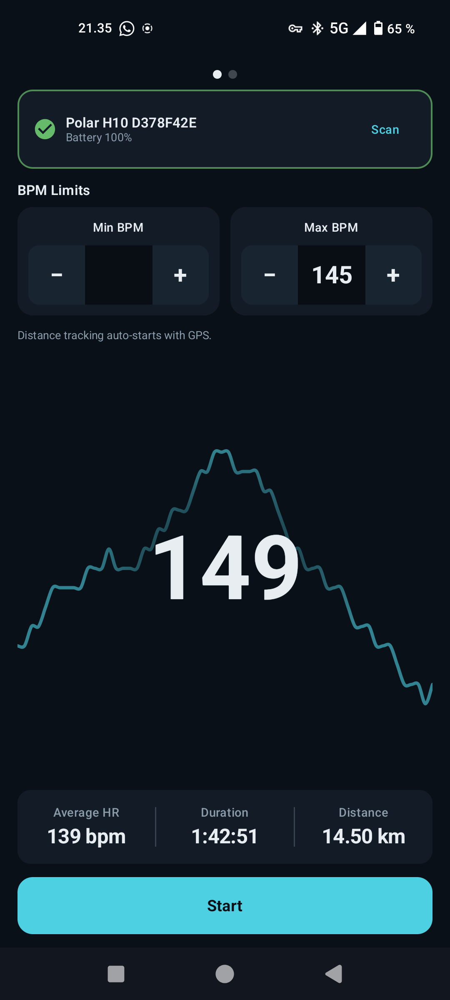
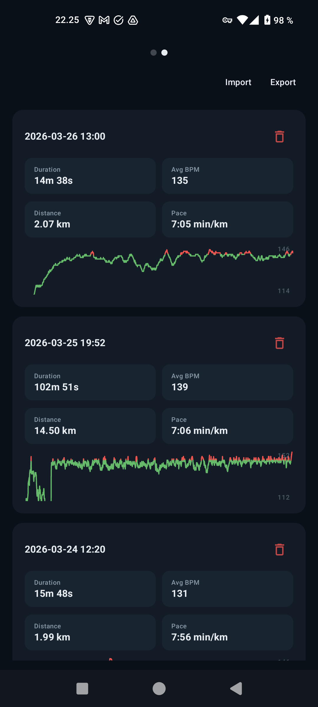

# HeartBeep

<p align="center">
  
</p>

HeartBeep connects to a Bluetooth Low Energy heart rate monitor and helps you stay in your target zone with simple, immediate audio alerts.

Built for training sessions where you do not want to keep checking your screen, HeartBeep shows your live heart rate, sounds an alert when you go above or below your chosen limits, and keeps monitoring in the background while your workout continues.

Short description: Live heart rate alerts from your Bluetooth sensor. Stay in the zone.

> The sections from "Why HeartBeep" through "Privacy" are the canonical user-facing app description and can be reused for the Play Store listing.

## Why HeartBeep

HeartBeep is designed to be fast and focused. Open the app, connect your sensor, choose your alert range, and start training. During a session, the app keeps you informed with clear feedback so you can adjust your effort without constantly looking at your phone.

## Features

- Connect to BLE heart rate monitors that support the standard Heart Rate Service profile
- Live heart rate display with a rolling graph
- Upper and lower heart rate alerts with adjustable limits
- Beep cadence that follows your current heart rate
- Voice alerts for sensor connection, disconnection, and each completed kilometer
- Optional GPS distance tracking during sessions
- Live pace tracking in min/km
- Foreground monitoring so tracking continues with the screen off
- Session history with duration, average heart rate, distance, pace, and heart rate graph
- Export and import session history in TCX format
- Battery level display plus saved thresholds and last connected device

## Screenshots

<p align="center">
  
  
  
  
</p>

## Compatibility

HeartBeep has been developed and tested with a Polar H10, but it should also work with other monitors that implement the standard BLE Heart Rate Service profile.

## Use Cases

- Zone-based endurance training
- Run and ride pacing support
- Heart rate cap alerts for easy sessions
- Lower-bound alerts for recovery intervals
- Outdoor sessions with optional distance and pace tracking

## Privacy

HeartBeep is designed for local use on your device. Session data and settings are stored on-device, and you can export or import your workout history whenever you want.

## Tech Stack

- Kotlin + Jetpack Compose (Material 3, no XML layouts)
- Single-activity MVVM with `ViewModel` and Kotlin `Flow`
- Room for session history and DataStore for saved preferences
- `AudioTrack` alarm tones plus `TextToSpeech` for spoken connection and distance alerts
- Android BLE GATT for Heart Rate and Battery Service profiles
- Foreground service with `FOREGROUND_SERVICE_CONNECTED_DEVICE` and optional `FOREGROUND_SERVICE_LOCATION`
- Min SDK 31 (Android 12), Target SDK 35

## Building

```bash
export JAVA_HOME="$HOME/.local/opt/jdk-17"
export ANDROID_SDK_ROOT="$HOME/Android/Sdk"

./gradlew testDebugUnitTest
./gradlew assembleDebug
```

The debug APK is written to `app/build/outputs/apk/debug/app-debug.apk`.

## Device Testing

BLE passthrough on the Android emulator is unreliable, so test on a real Android 12+ device with a physical heart rate monitor. Install via ADB:

```bash
adb install app/build/outputs/apk/debug/app-debug.apk
```

Runtime permissions required: `BLUETOOTH_SCAN`, `BLUETOOTH_CONNECT`, `POST_NOTIFICATIONS`, and optionally `ACCESS_FINE_LOCATION` for GPS tracking.
